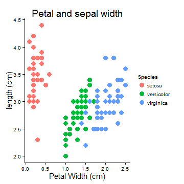

## Why create this app

1. For botanist who want to study taxonomy 
2. For people who enjoy knowing about iris species 
3. For appreication of the power of machine learning 

--- .class #id

## Sizes of sepal and petal are useful parameters in predicting iris species

As shown by the plot with sepal and petal width below, 3 iris species represented with 3 different colors are clearly separated, with little overlap.

The size of sepal and petal are reliable parameters for predicting iris species 

 

--- .class #id

## Predict iris species by decision tree
 

--- .class #id

## Iris prediction by tree method is very accurate (accuracy=0.96) 


```
## Confusion Matrix and Statistics
## 
##             Reference
## Prediction   setosa versicolor virginica
##   setosa         15          0         0
##   versicolor      0         15         2
##   virginica       0          0        13
## 
## Overall Statistics
##                                           
##                Accuracy : 0.9556          
##                  95% CI : (0.8485, 0.9946)
##     No Information Rate : 0.3333          
##     P-Value [Acc > NIR] : < 2.2e-16       
##                                           
##                   Kappa : 0.9333          
##  Mcnemar's Test P-Value : NA              
## 
## Statistics by Class:
## 
##                      Class: setosa Class: versicolor Class: virginica
## Sensitivity                 1.0000            1.0000           0.8667
## Specificity                 1.0000            0.9333           1.0000
## Pos Pred Value              1.0000            0.8824           1.0000
## Neg Pred Value              1.0000            1.0000           0.9375
## Prevalence                  0.3333            0.3333           0.3333
## Detection Rate              0.3333            0.3333           0.2889
## Detection Prevalence        0.3333            0.3778           0.2889
## Balanced Accuracy           1.0000            0.9667           0.9333
```
